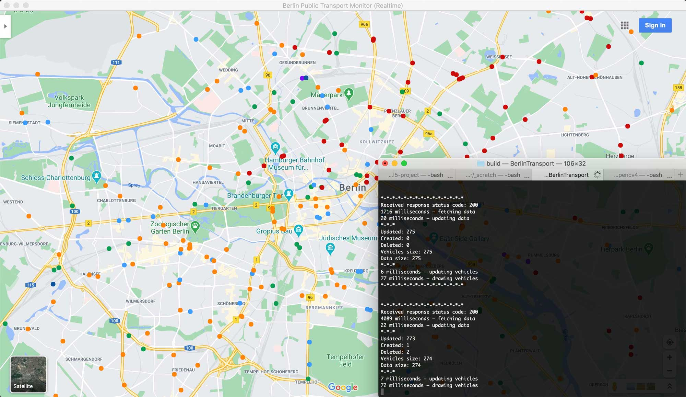

# Capstone Project (Udacity C++ Nanodegree)

This is the description of and the instruction for running the Berlin Realtime Public Transport Monitor designed by Sergei Kononov as a Capstone Project in the Udacity C++ Nanodegree program in September 2020.

## Project Description

The aim of the project is to display and track all public transport units operating at the current time in Berlin, Germany. The project uses data from the API [provided](https://github.com/public-transport/hafas-client/blob/5/docs/radar.md) by the Transportation Union of Berlin and Brandedburg (Verkehrsverbund Berlin-Brandenburg, VBB) and HAFAS to track realtime geographic locations of all types of public transport vehicles at a given part of the map. The transport units include:

* Buses           (orange)
* Trams           (red)
* Subway trains   (light blue)
* Suburban trains (green)
* Express trains  (dark blue)
* Regional trains (purple)
* Ferries         (brown, larger blob)

According to the HAFAS/VBB [documentation](https://github.com/public-transport/hafas-client/blob/5/docs/radar.md), the API allows a user to send up to 100 requests per minute; in practice, however, it returns real updates approximately every 7-10 seconds.

xxx

## File and Class Structure

The README also indicates the file and class structure, along with the expected behavior or output of the program.

## Dependencies for Running Locally

* cmake >= 3.9
  * All OSes: [click here for installation instructions](https://cmake.org/install/)
* make >= 4.1 (Linux, Mac), 3.81 (Windows)
  * Mac: [install Xcode command line tools to get make](https://developer.apple.com/xcode/features/)
  * Linux: make is installed by default on most Linux distros
  * Windows: [Click here for installation instructions](http://gnuwin32.sourceforge.net/packages/make.htm)
* gcc/g++ >= 5.4
  * Mac: same deal as make - [install Xcode command line tools](https://developer.apple.com/xcode/features/)
    * An alternative to conventional gcc/g++ on Mac: use llvm-gcc (`export CC=/usr/bin/llvm-gcc`) and llvm-g++ (`export CXX=/usr/bin/llvm-g++`)
  * Linux: gcc / g++ is installed by default on most Linux distros
  * Windows: recommend using [MinGW](http://www.mingw.org/)
* OpenCV >= 4.1.0 ([general installation instructions](https://docs.opencv.org/4.2.0/df/d65/tutorial_table_of_content_introduction.html))
  * [Mac](https://docs.opencv.org/4.2.0/d0/db2/tutorial_macos_install.html)
  * [Linux](https://docs.opencv.org/4.2.0/d7/d9f/tutorial_linux_install.html)
  * [Windows](https://docs.opencv.org/4.2.0/d3/d52/tutorial_windows_install.html)
* C++ REST SDK, formerly known as Casablanca ([GitHub page](https://github.com/Microsoft/cpprestsdk)). The library requires installation of development files for Boost and OpenSSL. Depending on your platform, please read detailed installation instructions for:
  * [Mac](https://github.com/Microsoft/cpprestsdk/wiki/How-to-build-for-Mac-OS-X)
  * [Linux](https://github.com/Microsoft/cpprestsdk/wiki/How-to-build-for-Linux)
  * [Windows](https://github.com/Microsoft/cpprestsdk/wiki/How-to-build-for-Windows)

## Build Instructions

After installing project dependencies, please proceed to build:

1. Clone this repository into your project folder
2. Make a build directory in the top level directory: `mkdir build && cd build`
3. Compile -> Step 1: `cmake ..` (should you have hard times linking the OpenSSL library, please tell cmake where OpenSSL files are located on your machine. Make sure to do it prior to calling `cmake ..`. Example for Mac: `export OPENSSL_ROOT_DIR=/usr/local/Cellar/openssl@1.1/1.1.1g/` and `export OPENSSL_INCLUDE_DIR=/usr/local/Cellar/openssl@1.1/1.1.1g/include/`)
4. Compile -> Step 2: `make`
5. Run the application: `./BerlinTransport`

## Rubric Points Addressed

The README indicates which rubric points are addressed. The README also indicates where in the code (i.e. files and line numbers) that the rubric points are addressed.

### README (All Rubric Points REQUIRED)

* A README with instructions is included with the project   --> Yes: `README.md` file included into the project root folder.
* The README indicates which project is chosen --> Yes: see section "Project Description" in the `README.md` file.
* The README includes information about each rubric point addressed --> Yes.

### Compiling and Testing (All Rubric Points REQUIRED)

* The submission must compile and run --> Yes.

### Loops, Functions, I/O

* The project demonstrates an understanding of C++ functions and control structures --> Yes.
* The project reads data from a file and process the data, or the program writes data to a file --> Yes & No: the project is designed to read and process data from a JSON stream received via the HTTP request (see `ApiData.h::52` and `ApiData.cpp::22`).
* The project accepts user input and processes the input --> No.

### Object Oriented Programming

* The project uses Object Oriented Programming techniques --> Yes: please see `ApiData.h`, `Vehicle.h`, `PublicTransport.h`, and `Graphics.h`, as well as all respective `.cpp` files.
* Classes use appropriate access specifiers for class members --> Yes.
* Class constructors utilize member initialization lists --> Yes: please see e.g. constructor `Data::Data()` in `ApiData.cpp::5`, constructor `Vehicle::Vehicle()` in `Vehicle.cpp::71` and constructor `PublicTransport::PublicTransport()` in `PublicTransport.cpp::4`.
* Classes abstract implementation details from their interfaces --> Yes.
* Classes encapsulate behavior --> Yes: e.g. `Graphics::Simulate()` in `Graphics.h::23`, `PublicTransport::Run()` in `PublicTransport.h::18`, etc.
* Classes follow an appropriate inheritance hierarchy --> No: no parent classes are implemented in this project.
* Overloaded functions allow the same function to operate on different parameters --> Yes: overloading a template though "Template specializations"; please see `Vehicle.h::31` and `Vehicle.cpp::8`.
* Derived class functions override virtual base class functions --> No: no virtual base classes implemented in the project.
* Templates generalize functions in the project --> Yes: see `Vehicle.h::28` and `Vehicle.cpp::4`.

### Memory Management

* The project makes use of references in function declarations --> Yes: see e.g. `void NormalizeLatitude(double &latitude)` and `void NormalizeLongitude(double &longitude)` in `Graphics.h::19` and `Graphics.h::20`.
* The project uses destructors appropriately --> Yes: see e.g. `Vehicle::~Vehicle()` in `Vehicle.cpp::87`; no `free` or `delete` used, as the project uses smart pointers.
* The project uses scope / Resource Acquisition Is Initialization (RAII) where appropriate --> Yes: see `std::shared_ptr<Data> _data` in `PublicTransport.h::20` and `std::vector<std::unique_ptr<Vehicle>> _vehicles` in `PublicTransport.h::23`.
* The project follows the Rule of 5 --> No: smart pointers are used instead.
* The project uses move semantics to move data, instead of copying it, where possible --> Yes: see `void Update(const web::json::value &&data)` in `ApiData.h::53`, `ApiData.cpp::47` and `ApiData.cpp::64`.
* The project uses smart pointers instead of raw pointers --> Yes & No: smart pointers are used in `PublicTransport.h::20`, `PublicTransport.h::23`, but raw pointers are used for learning purposes in `Graphics.h::31`, `PublicTransport.h::21` and `PublicTransport.h::22`.

### Concurrency

* The project uses multithreading --> No: a multithreading setup added to `Graphics::DrawVehicles()` in `Graphics.cpp::70`, but "linear" execution is chosen (`std::launch::deferred`). The dataset of 500+ vehicles is too small to run async.
* A promise and future is used in the project --> Yes: see `Graphics::DrawVehicles()` in `Graphics.cpp::70`.
* A mutex or lock is used in the project --> No.
* A condition variable is used in the project --> No.
