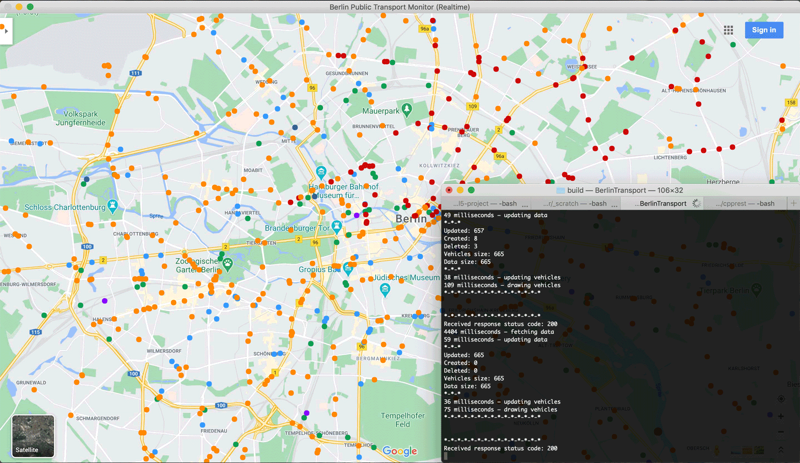

# Realtime Public Transport Monitor – Berlin 

The project is built out of curiosity to visualize realtime public transportation system in a densely-populated urban area. With the ever-increasing pace of urbanization globally, extended versions of similar applications can contribute to improving urban transportation systems, especially taking into account problems of energy supply, logistics and environmental concerns.

Possible application extensions can include:

* Mapping the most dense and public transport routes – can be beneficial for GPS systems to re-route passenger vehicle / local logistics traffic to increase speed of commuting
* Mapping traffic to track the most delay-prone time of the day for the local public transport, as well as mappring jammed urban areas
* And others

## Project Description

The goal of the project is to track, map and display all public transport units operating at the current time in Berlin, Germany. The project uses data from the API [provided](https://github.com/public-transport/hafas-client/blob/5/docs/radar.md) by the Transportation Union of Berlin and Brandedburg (Verkehrsverbund Berlin-Brandenburg, VBB) and HAFAS ([company website](https://www.hacon.de/en/solutions/trip-planner-and-travel-companion/), [about HAFAS in Wikipedia](https://de.wikipedia.org/wiki/HAFAS)) to track realtime geographic locations of all types of public transport vehicles at a given part of the map. The documentation to the API used in this project is written by [Jannis Redmann (aka derhuerst)](https://github.com/derhuerst).

The transport units include:

* Buses           (orange)
* Trams           (red)
* Subway trains   (light blue)
* Suburban trains (green)
* Express trains  (dark blue)
* Regional trains (purple)
* Ferries         (brown, larger blob)

According to the [documentation](https://github.com/public-transport/hafas-client/blob/5/docs/radar.md) written by [Jannis Redmann](https://github.com/derhuerst), the API allows a user to send up to 100 requests per minute. This works nominally, but in practice the VBB's server sends real updates approximately every 8-12 seconds, therefore vehicle positions will update every 8-12 seconds.

## Expected Behavior

After the application is launched, a window with map should be displayed, where vehicles are displayed. The vehicles' positions should update approx. every 8-12 seconds, whereas HTTP requests should be send every 3-5 seconds. The VBB server allows sending up to 100 HTTP requests per minute, but the real data on the server renews every 8-12 seconds only, hence the long update time.

## Dependencies for Running Locally

* CMake >= 3.9
* Make >= 4.1 (Linux, Mac), 3.81 (Windows)
* OpenCV >= 4.1.0
* [C++ REST SDK](https://github.com/Microsoft/cpprestsdk) (formerly Casablanca). The library requires installation of development files for Boost and OpenSSL. Depending on your machine, please read detailed installation instructions for:
  * [Mac](https://github.com/Microsoft/cpprestsdk/wiki/How-to-build-for-Mac-OS-X)
  * [Linux](https://github.com/Microsoft/cpprestsdk/wiki/How-to-build-for-Linux)
  * [Windows](https://github.com/Microsoft/cpprestsdk/wiki/How-to-build-for-Windows)

## Build Instructions

After installing project dependencies, please proceed to build:

1. Clone this repository into your project folder
1. Make a build directory in the top level directory: `mkdir build && cd build`
1. Compile -> Step 1: `cmake ..` (should you have hard times linking the OpenSSL library, please tell cmake where OpenSSL files are located on your machine. Make sure to do it prior to calling `cmake ..`. Example for Mac: `export OPENSSL_ROOT_DIR=/usr/local/Cellar/openssl@1.1/1.1.1g/` and `export OPENSSL_INCLUDE_DIR=/usr/local/Cellar/openssl@1.1/1.1.1g/include/`)
1. Compile -> Step 2: `make`
1. Run the application: `./BerlinTransport`